Dietary impact on enterococcus bloom
================
Tsoni, Brianna, Madhu, Sandeep

## Decreased gut microbiome diversity is commonly associated with Enterococcus domination

Observational cohort study of 1362 allo-HCT recipients showed that
reduced median alpha diversity of stool microbiome during the
peri-engraftment period (Days 7-21) post allo-HCT was associated with
non-relapse mortality, GVHD, and overall survival (Peled et al. 2020).

<table>
<colgroup>
<col style="width: 40%" />
<col style="width: 60%" />
</colgroup>
<tbody>
<tr class="odd">
<td style="text-align: center;">

<figure>
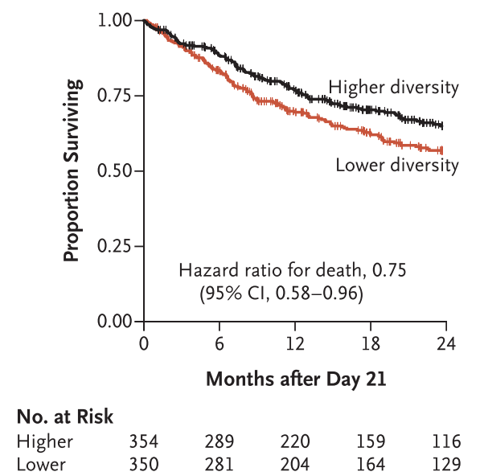
<figcaption aria-hidden="true">Overall survival associated with
diversity</figcaption>
</figure>

</td>
<td style="text-align: center;">

<figure>
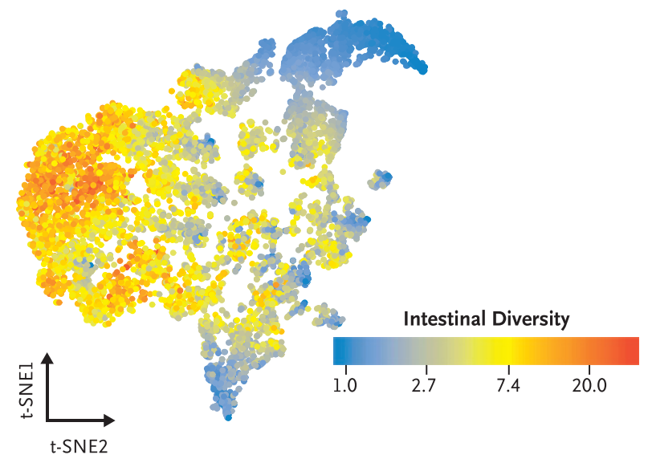
<figcaption aria-hidden="true">tSNE by alpha diversity</figcaption>
</figure>

</td>
</tr>
</tbody>
</table>

<table>
<colgroup>
<col style="width: 100%" />
</colgroup>
<tbody>
<tr class="odd">
<td style="text-align: center;">

<figure>
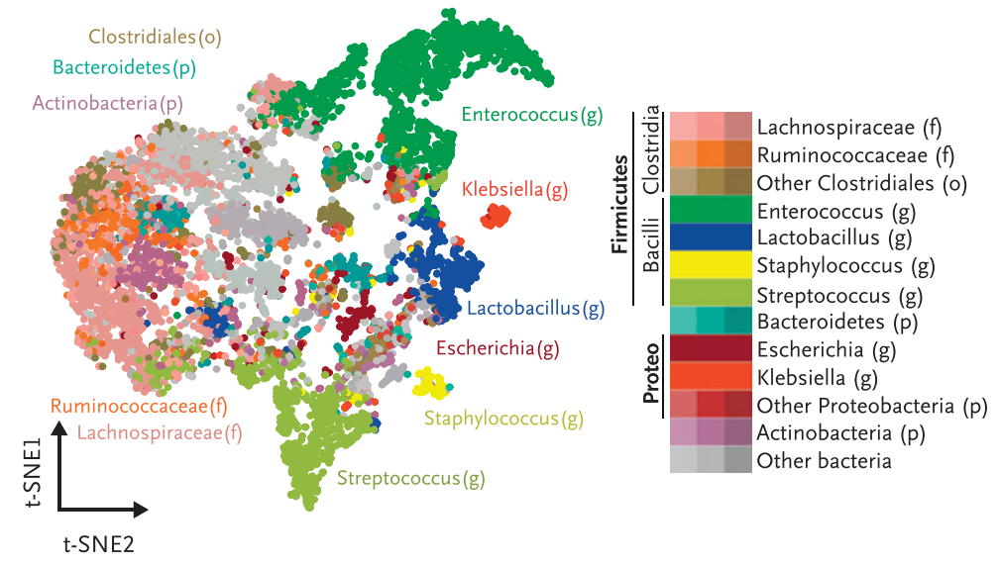
<figcaption aria-hidden="true">tSNE by dominant taxon</figcaption>
</figure>

</td>
</tr>
</tbody>
</table>

Figure 1: Enterococcus domination associated with low alpha diversity

There are several questions here:

1.  Why does alpha diversity decrease peri-alloHCT?
2.  Is *Enterococcus* domination (ECD) the cause or a symptom of reduced
    diversity?
3.  Why do some patients experience ECD while others do not?
4.  Is there a mechanism that unifies ECD, diversity decrease, and
    reduced OS?

There are two hypotheses, not mutually exclusive, where *Enterococcus*
is given a selective advantage. The first is that dysbiosis induced by
antibiotic administration opens a niche for *Enterococcus* bloom(Taur et
al. 2012). The second is that certain diets promote *Enterococcus*
growth. Both of these lead to reduced microbial diversity and loss of
functional metagenomic metabolic pathways necessary for healthy gut
barrier function and immune reconstitution after alloHCT.

Additionally, ileal floras of mice with GVHD are distinct from untreated
mice and treated mice without GVHD (Jenq et al. 2012). Potentially
dysbiosis leads to increased gut alloreactivity as a potential
contributor to worse outcomes.

## Antibiotics without VRE coverage promote Enterococcus colonization

Donskey et al established a mouse model in which parenteral
administration of human-equivalent mg/kg doses of various beta lactam
antibiotics with minimal activity against *Enterococcus* for 2 days
q12hrs prior to gavage with 102 or 104 CFUs in
0.5mL of VRE induced 7 orders of magnitude more VRE stool growth than
saline or piperacillin-tazobactem (which has activity against VRE in the
upper GI tract) [#fig-donskey](#fig-donskey),

They noted that this bloom occurred with gavage of either 102
or 104 CFUs.

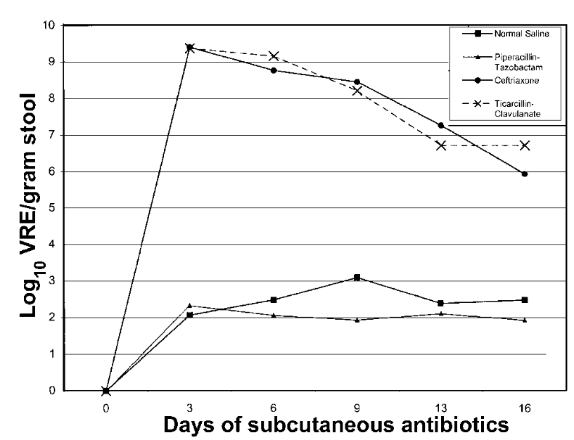 Beta lactam antibiotics prior to VRE gavage

Figure 2: Abx without VRE coverage lead to VRE bloom

Rob Jenq and Eiko Hayase have also shown (unpublished) that specific
titrations of various antibiotics lead to endogenous *Enterococcus*
bloom.

Eric Pamer’s group has shown that after colonization, VRE can persist
for months and can be cleared by fecal microbiota transplantation with
the hypothesis that there are gut commensals that confer resistance to
VRE-colonization(Caballero et al. 2015). However, many are obligate
anaerobes that evolve as part of a community of interdependent strains,
and so identifying resistance-conferring species is
challenging(Rakoff-Nahoum, Foster, and Comstock 2016).

To circumvent this problem, they generated antibiotic resistant
commensals (ARMs) by isolating stool from a mouse strain treated
continuously with antibiotics for 15 years. Three doses of PBS or ARM
were administered daily by oral gavage to C57BL/6 ampicillin-treated
mice beginning on day 2 of ampicillin treatment. Fecal samples were
collected before antibiotics (d0) and on days 1 (prior to transplant),
4, 8, and 15 after antibiotic initiation(Caballero et al. 2017).

<table>
<colgroup>
<col style="width: 75%" />
<col style="width: 25%" />
</colgroup>
<tbody>
<tr class="odd">
<td style="text-align: center;">

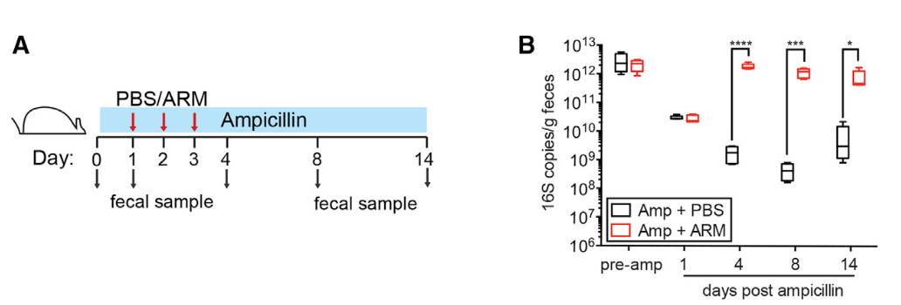

</td>
<td style="text-align: center;">

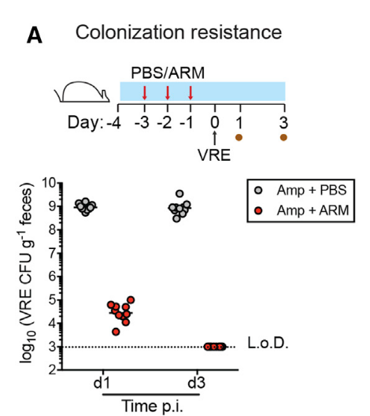

</td>
</tr>
</tbody>
</table>

Figure 3: ARMs confer resistance to dysbiosis and VRE colonization

They were also able to isolate the most critical components of the ARM
population and reconstitute a more focused panel of microbes that
conferred similar properties to bulk ARMs.

Taken together, these data show that dysbiosis with loss of specific
commensals induced by certain antibiotics leads to *Enterococcus* bloom.
That certain patients are resistant to this phenomenon (that antibiotic
exposure is not sufficient) suggests the presence of another variable.

## Dietary fructose alters microbiome and is associated with colitis

In WT C57BL/6J mice, high fructose diet (HFrD) worsened colitis severity
compared to controls (Montrose et al. 2021). Worsened rates of colitis
were observed when colonic contents of fructose treated mice were
gavaged into non-treated mice [#fig-montrose](#fig-montrose).

HFrD is also associated with increased host inflammatory response,
including IL6, IL-1B, TNFa upregulation, and increased immune cell
migration to the gut lining (Kawabata et al. 2019). In some models of
colitis, *GLUT5* loss may allow persistent elevation of intraluminal
fructose leading to taxonomic shifts (Basu et al. 2021).

<table>
<colgroup>
<col style="width: 100%" />
</colgroup>
<tbody>
<tr class="odd">
<td style="text-align: center;">

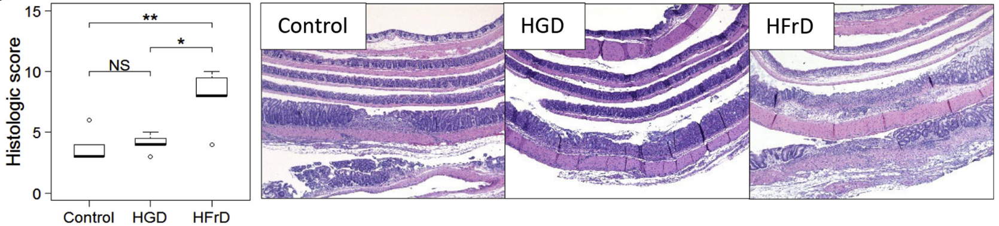 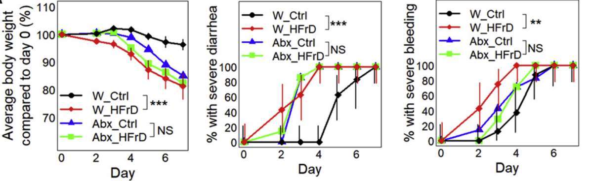

</td>
</tr>
</tbody>
</table>

Figure 4: Dietary fructose induces colitis via microbiome alterations

16S rRNA sequencing of rats fed with HFrD has shown distinct changes in
microbiome composition with increased abundances of *Ruminococcus* and
*Coprococcus*, and that adverse outcomes associated with HFrD can be
rescued with antibiotics Di Luccia et al. (2015).

Prolonged fructose exposure may provide selective advantage to taxa that
disrupt mucosal barrier, such as mucus-degrading *Akkermansia
muciniphila* and *Bacteroides fragilis* (Khan et al. 2020)*.* This
phenomenon could again be rescued with
antibiotics[#fig-khan](#fig-khan).

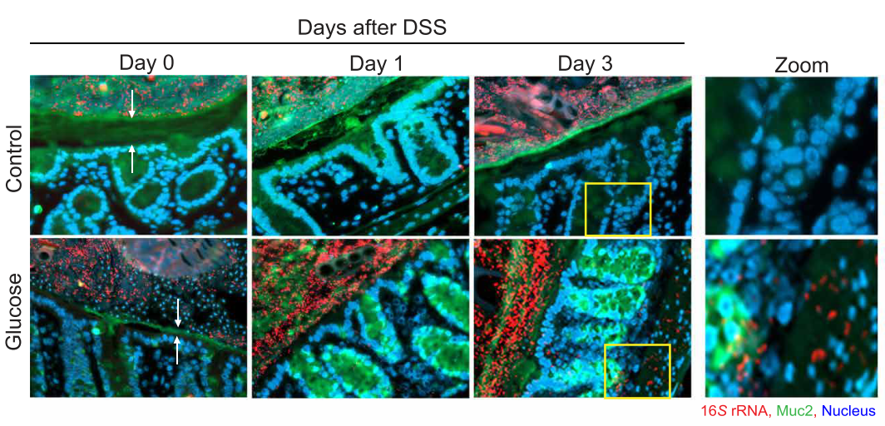

Figure 5: Glucose treated mice had more mucin degradation and loss of
barrier integrity

We know from Angel Dai’s work, looking at carefully monitored daily
dietary intake resolved to individual foods and shotgun metagenomic
sequencing in 97 patients peri-alloHCT, that sweets and fruit sugar
intake are associated with *enterococcacae* abundance and reduced
population alpha diversity. The figures below suggest the following
narrative: simple fruit sugars are associated with increased
*Enterococcus* growth rate (Long et al. 2021) which leads to
*Enterococcus* bloom a few days later (unpublished).

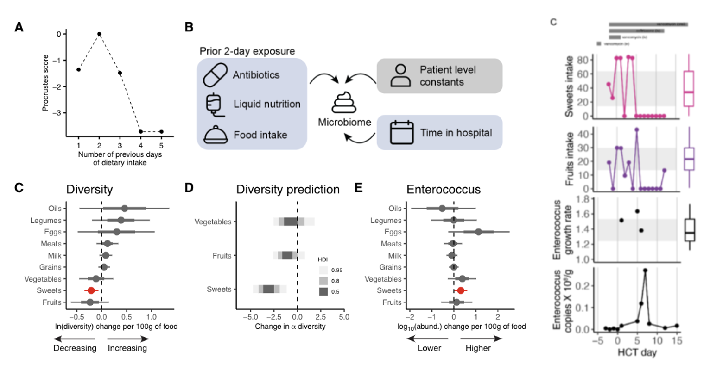

Figure 6: Fruit sugars associated with *Enterococcus* growth and reduced
diversity

## Specific Aims

Perhaps we can salvage antibiotic induced dysbiosis peri-alloHCT with
dietary changes prior to *Enterococcus* bloom. A long-term goal would be
to see if this can improve OS related to transplant.

1.  Establish an antibiotic-treated mouse model with a parameter that
    can produce a dynamic range of stool *Enterococcus* abundance.
2.  Evaluate the effect of a high fructose diet on *Enterococcus* bloom
    in this model.
3.  Identify metagenomic and metatranscriptomic changes associated with
    *Enterococcus* bloom in the mouse gut microbiome with and without a
    high fructose diet.

## Aim 1

### Common Design Features

**Overall workflow:**

1.  Antibiotic treatment of different mouse groups (each group has
    variation in dosing, type, and timing of antibiotics or VRE
    inoculum)
2.  VRE gavage the mice (Day 0)
3.  Stool collection and selective plating on subsequent days

**VRE stock**:

-   Strain is VRE (Orla-Jensen) with vanA, IS16 and esp genes. Resistant
    to vancomycin and teicoplanin.
-   10uL of stock VRE diluted to 1:1000 dilution in 1mL was plated on
    +streptomycin, +vancyomycin selective media and a single colony was
    picked for growth to isolate a single strain.
-   Colony was suspended in a BHI broth and incubated for 24 hours
    without additives to catch end of log phase. Serial dilutions plated
    on selective media to calculate concentration (For our stocks there
    were 77 CFUs in 100uL at a 10^-6 dilution).
-   Incubated BHI suspended in 30% glycerol in PBS to make multiple
    vials of VRE stock. Each vial contains about 1.5mL at a
    concentration of 7.7x10^8 CFU/mL.

**Antibiotics**:

-   Initial examination of ampicillin (easy to administer, no activity
    against VRE).
-   Drinking water containing ampicillin (0.5 g/L) should be changed
    every 3 days

| **Antibiotic**          | **Route**      | **Dose**  | **Volume** | **Regimen**    |
|---------------|---------------|---------------|---------------|---------------|
| Clindamycin             | subq           | 1.4mg/kg  | 100 uL     | daily - 2 days |
| Piperacillin-tazobactam | Subq           | 500 mg/kg | 100 uL     | daily - 2 days |
| Ceftriaxone             | Subq           | 100 mg/kg | 100 uL     | daily - 2 days |
| Metronidazole           | drinking water | .5g/L     | 400mL      | 2 days         |
| Vancomycin              | drinking water | 250ug/mL  | 400mL      | 2 days         |
| Aztreonam               | drinking water | 0.5g/L    | 400mL      | 2 days         |
| Doxycycline             | IP             | 1.5 mg/kg | 100 uL     | daily - 2 days |
| Ampicillin              | drinking water | 0.5g/L    | 400mL      | 2 days         |

Administer each cage 0.3mg/mL Sucralose in 400mL water (120mg) because
metronidazole adds a bad taste to the water.

Notes: Long term administration of art. sweeteners have been shown to
increase antibiotic restistance through plasmid transfer (in vitro),
negatively affect mice during long-term administration
(https://www.sciencedirect.com/science/article/pii/S1319016420301997),
and negatively affect the gut microbiome
(https://www.frontiersin.org/articles/10.3389/fnut.2022.848392/full)

**Mouse setup:**

-   Either BALB/c or B6 mice must be sourced from Jax max barrier room
    to ensure ampicillin-sensitive microbiome
-   Mice should be housed in autoclaved cages (can be requested through
    RARC) throughout experiment. Consider autoclaved water and sterile
    gloves and gowns and only using them in a hood etc.
-   Mice should be screened for pre-existing VRE colonization by
    selective plating before proceeding with each experiment(Donskey et
    al. 2000). Reminder to collect & plate fecal pellets at baseline
    before manipulation to document lack of VRE at baseline.
-   NB: reminder to move cages to single-housing upon VRE innoculation

**Gavage preparation:**

-   A frozen glycerol stock of VRE is thawed and spun down at 4000 RPM
    (\~5,000 g) for 10 minutes. Discard culture media and resuspend
    bacteria pellet in sterile PBS to dilute to make the requisite
    concentration for gavage (typically 10^4 to 10^8 CFUs per 200uL).
-   NB: reminder to move cages to single-housing upon VRE innoculation

**VRE-selection media:**

-   Difco Enterococcosel agar (supplemented with 8 μg/ml vancomycin and
    100 μg/ml streptomycin)
-   Autoclave using liquid 20 program
-   Plates are stored upside down in cold room until use
-   For VRE quantification, several dilutions of weighed fecal samples
    resuspended in PBS were plated on selection plates in the incubator
    for 48 hours

**Measuring VRE CFUs**

-   Collect fresh mouse pellets in pre-weighed tubes
-   Record pellet weight
-   Resuspend pellet in 1000mL PBS
-   Homogenize using multitube vortexer for approximately 5-10 minutes
    some stool debris is expected, no large pellets should remain
-   Generate 4 serial dilutions on a 96 well plate for each stool
    sample. 10^-1, 10^-3, 10^-4, 10^-5 (suspend 20uL in 180uL of
    diluent).
-   Can plate 15-20uL of the dilutions on one of several options:
    -   1 sample per plate: Circular plate with 4 divisions (drop \~5
        glass microbeads into each quadrant and shake)
    -   3 samples per 2 plates: 6-well tissue culture plate (drop \~5
        glass microbeads into each well and shake)
    -   1 sample per plate: A single non-divided plate, but draw 4
        quadrants (one for each dilution per sample) and use sterile
        spreaders to streak colonies in each quadrant
-   Enumerate colonies on the plates 48 hours later. Record number of
    colonies, the amount plated (e.g. 15 uL), and the dilution of the
    well/quadrant being counted (ideally pick the dilution with roughly
    between \~10-100 colonies to optimize sampling and counting error)

### Pilot Experiment 1:

#### - Gavage with VRE is necessary and sufficient for domination.

#### - Dysbiosis induced by ampicillin increases extent of domination

| Date       | Day to Gavage | Intervention/Assay for all 4 groups |
|------------|---------------|-------------------------------------|
| 2022-02-25 | -5            | Ampicillin                          |
| 2022-02-26 | -4            | Ampicillin                          |
| 2022-02-27 | -3            | Ampicillin                          |
| 2022-02-28 | -2            | Ampicillin                          |
| 2022-03-01 | -1            | Ampicillin                          |
| 2022-03-02 | 0             | Ampicillin and VRE gavage           |
| 2022-03-03 | 1             | Stool collection and plating        |
| 2022-03-04 | 2             | Stool collection and plating        |

Experiment 1 Pilot Design

Four experimental groups:

1.  No ampicillin treatment, no VRE gavage
2.  No ampicillin treatment, + VRE gavage
3.  Ampicillin treatment, no VRE gavage
4.  Ampicillin treatment, + VRE gavage

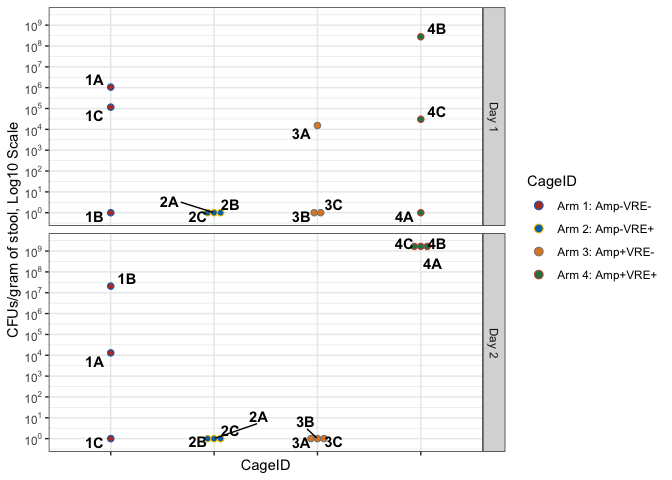

### Experiment 2:

#### Varying days of ampicillin exposure does not confer a dynamic range of VRE stool growth

| Date       | Day to Gavage | Arm 1                        |            Arm 2             | Arm 3                        | Arm 4                        | Arm 5                        |
|-----------|-----------|-----------|:---------:|-----------|-----------|-----------|
| 2022-03-10 | -5            | amp                          |             amp              | amp                          |                              | Prior Amp LD 03-01-2022      |
| 2022-03-11 | -4            | amp                          |             amp              | amp                          |                              | \[rest\]                     |
| 2022-03-12 | -3            | amp                          |             amp              | \[rest\]                     |                              | \[rest\]                     |
| 2022-03-13 | -2            | amp                          |             amp              | \[rest\]                     |                              | \[rest\]                     |
| 2022-03-14 | -1            | amp                          |             amp              | \[rest\]                     | amp                          | \[rest\]                     |
| 2022-03-15 | 0 (Gavage)    | VRE 10^8                     |           VRE 10^7           | VRE 10^7                     | VRE 10^7                     | VRE 10^7                     |
| 2022-03-16 | 1             | Stool collection and plating | Stool collection and plating | Stool collection and plating | Stool collection and plating | Stool collection and plating |
| 2022-03-17 | 2             | Stool collection and plating | Stool collection and plating | Stool collection and plating | Stool collection and plating | Stool collection and plating |
| 2022-03-19 | 5             | Stool collection and plating | Stool collection and plating | Stool collection and plating | Stool collection and plating | Stool collection and plating |

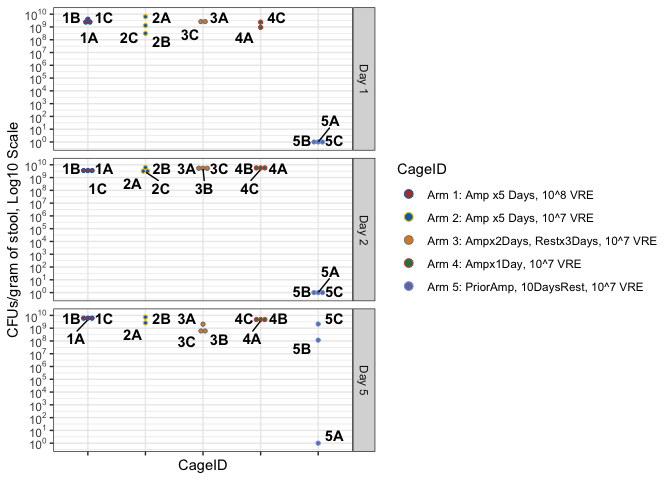

### Experiment 3:

#### Varying dose of VRE inoculum does not confer a dynamic range of VRE stool growth

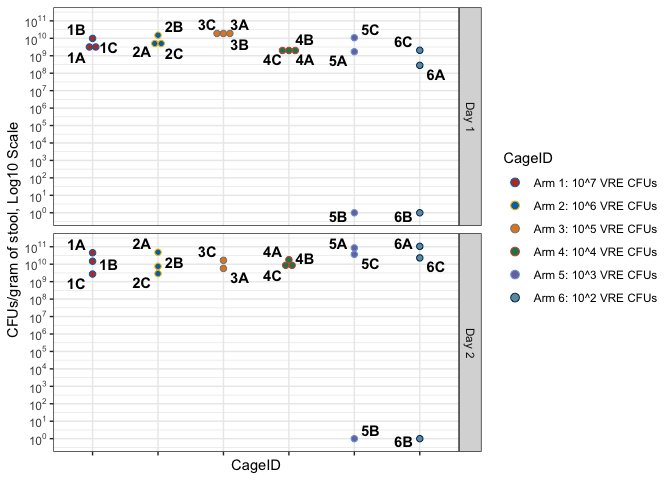

### Experiment 4:

#### Varying days of rest after ampicillin exposure does not confer a dynamic range of VRE stool growth

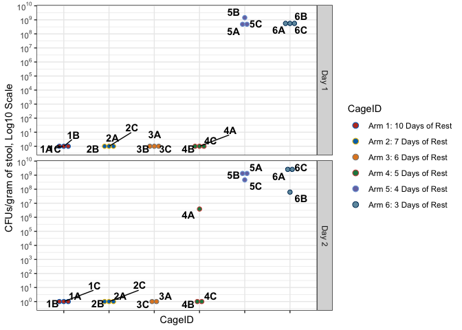

### Experiment 5:

#### Out of 8 antibiotics, clindamycin conferred a dynamic range of VRE stool growth

Notes: \*Group 8 was given 1/10 of the appropriate dose for Pip-Tazo on
second day. 1st day was okay.

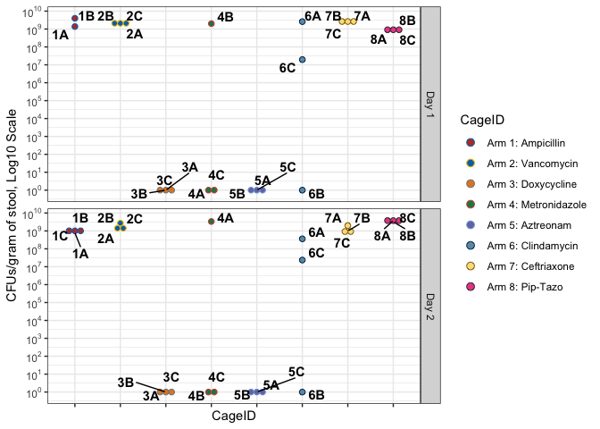

Basu, Srijani, Catherine Liu, Xi Kathy Zhou, Ryohei Nishiguchi, Taehoon
Ha, Justin Chen, Melanie Johncilla, Rhonda K. Yantiss, David C.
Montrose, and Andrew J. Dannenberg. 2021. “GLUT5 is
a determinant of dietary fructose-mediated exacerbation of experimental
colitis.” *American Journal of Physiology-Gastrointestinal and
Liver Physiology* 321 (2): G232–42.
<https://doi.org/10.1152/ajpgi.00059.2021>.

Caballero, Silvia, Rebecca Carter, Xu Ke, Bože Sušac, Ingrid M. Leiner,
Grace J. Kim, Liza Miller, Lilan Ling, Katia Manova, and Eric G. Pamer.
2015. “Distinct but Spatially Overlapping
Intestinal Niches for Vancomycin-Resistant Enterococcus faecium and
Carbapenem-Resistant Klebsiella pneumoniae.” *PLoS Pathogens* 11
(9): 1–20. <https://doi.org/10.1371/journal.ppat.1005132>.

Caballero, Silvia, Sohn Kim, Rebecca A. Carter, Ingrid M. Leiner, Bože
Sušac, Liza Miller, Grace J. Kim, Lilan Ling, and Eric G. Pamer. 2017.
“Cooperating Commensals Restore Colonization
Resistance to Vancomycin-Resistant Enterococcus faecium.” *Cell
Host and Microbe* 21 (5): 592–602.e4.
<https://doi.org/10.1016/j.chom.2017.04.002>.

Di Luccia, Blanda, Raffaella Crescenzo, Arianna Mazzoli, Luisa Cigliano,
Paola Venditti, Jean Claude Walser, Alex Widmer, Loredana Baccigalupi,
Ezio Ricca, and Susanna Iossa. 2015. “Rescue of
fructose-induced metabolic syndrome by antibiotics or faecal
transplantation in a rat model of obesity.” *PLoS ONE* 10 (8):
1–19. <https://doi.org/10.1371/journal.pone.0134893>.

Donskey, Curtis J., Jennifer A. Hanrahan, Rebecca A. Hutton, and Louis
B. Rice. 2000. “Effect of parenteral antibiotic
administration on the establishment of colonization with
vancomycin-resistant Enterococcus faecium in the mouse gastrointestinal
tract.” *Journal of Infectious Diseases* 181 (5): 1830–33.
<https://doi.org/10.1086/315428>.

Jenq, Robert R., Carles Ubeda, Ying Taur, Clarissa C. Menezes, Raya
Khanin, Jarrod A. Dudakov, Chen Liu, et al. 2012. “Regulation of intestinal inflammation by microbiota
following allogeneic bone marrow transplantation.” *Journal of
Experimental Medicine* 209 (5): 903–11.
<https://doi.org/10.1084/jem.20112408>.

Kawabata, Katsuto, Shuji Kanmura, Yuko Morinaga, Akihito Tanaka, Tomoaki
Makino, Toshihiro Fujita, Shiho Arima, et al. 2019. “A high-fructose diet induces epithelial barrier
dysfunction and exacerbates the severity of dextran sulfate
sodium-induced colitis.” *International Journal of Molecular
Medicine* 43 (3): 1487–96. <https://doi.org/10.3892/ijmm.2018.4040>.

Khan, Shahanshah, Sumyya Waliullah, Victoria Godfrey, Md Abdul Wadud
Khan, Rajalaksmy A. Ramachandran, Brandi L. Cantarel, Cassie Behrendt,
Lan Peng, Lora V. Hooper, and Hasan Zaki. 2020. “Dietary simple sugars alter microbial ecology in the gut
and promote colitis in mice.” *Science Translational Medicine* 12
(567). <https://doi.org/10.1126/scitranslmed.aay6218>.

Long, Andrew M., Shengwei Hou, J. Cesar Ignacio-Espinoza, and Jed A.
Fuhrman. 2021. “Benchmarking microbial growth rate
predictions from metagenomes.” *ISME Journal* 15 (1): 183–95.
<https://doi.org/10.1038/s41396-020-00773-1>.

Montrose, David C., Ryohei Nishiguchi, Srijani Basu, Hannah A. Staab, Xi
Kathy Zhou, Hanhan Wang, Lingsong Meng, et al. 2021. “Dietary Fructose Alters the Composition, Localization,
and Metabolism of Gut Microbiota in Association With Worsening
Colitis.” *Cmgh* 11 (2): 525–50.
<https://doi.org/10.1016/j.jcmgh.2020.09.008>.

Peled, Jonathan U., Antonio L. C. Gomes, Sean M. Devlin, Eric R.
Littmann, Ying Taur, Anthony D. Sung, Daniela Weber, et al. 2020. “Microbiota as Predictor of Mortality in Allogeneic
Hematopoietic-Cell Transplantation.” *New England Journal of
Medicine* 382 (9): 822–34. <https://doi.org/10.1056/nejmoa1900623>.

Rakoff-Nahoum, Seth, Kevin R. Foster, and Laurie E. Comstock. 2016.
“The evolution of cooperation within the gut
microbiota.” *Nature* 533 (7602): 255–59.
<https://doi.org/10.1038/nature17626>.

Taur, Ying, Joao B. Xavier, Lauren Lipuma, Carles Ubeda, Jenna Goldberg,
Asia Gobourne, Yeon Joo Lee, et al. 2012. “Intestinal domination and the risk of bacteremia in
patients undergoing allogeneic hematopoietic stem cell
transplantation.” *Clinical Infectious Diseases* 55 (7): 905–14.
<https://doi.org/10.1093/cid/cis580>.
